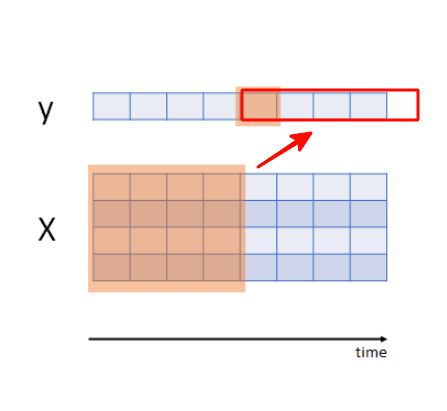
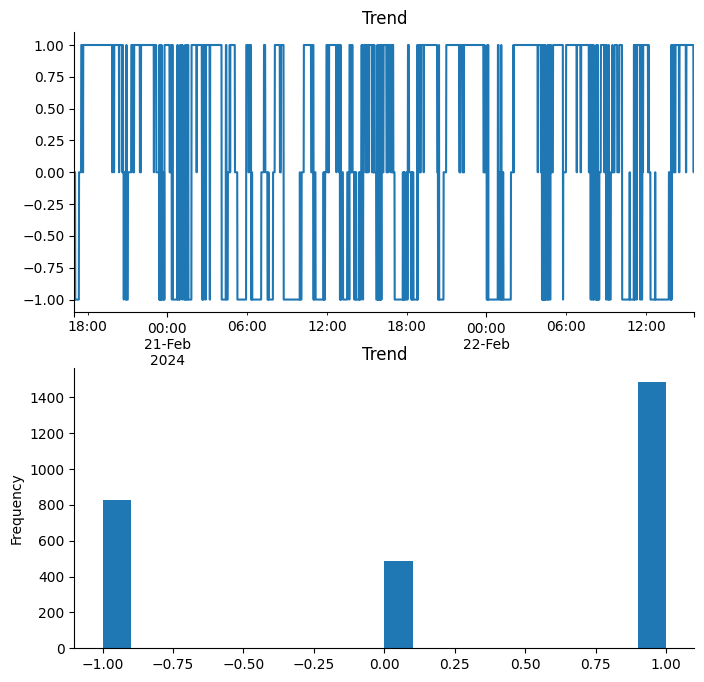

# **Проект по работе с биржквыми данными включая "стакан"**

  

# Сигнал для робота будет формироваться из сигналов двух сетей.

- Сеть для предсказания цены на 5ть шагов
  

- Сеть для предсказания тренда на 5ть шагов
-   

