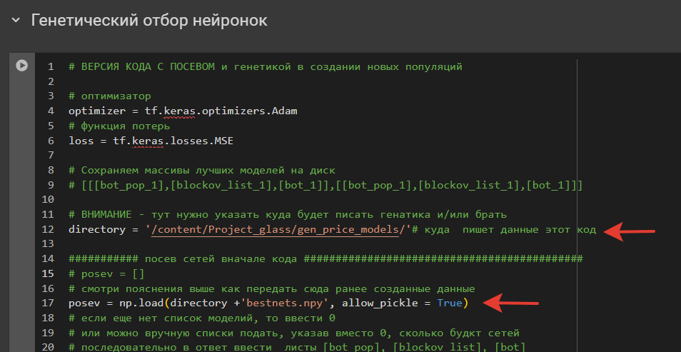
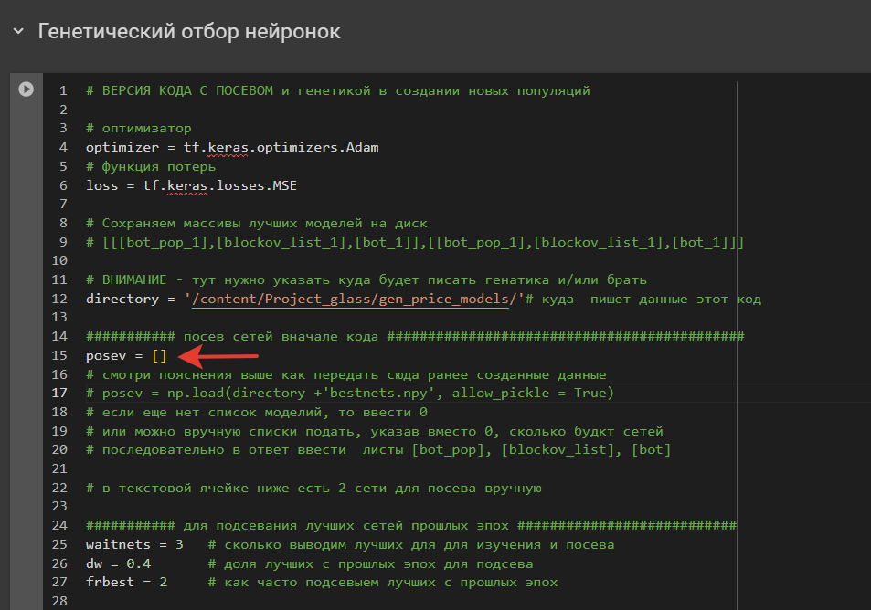
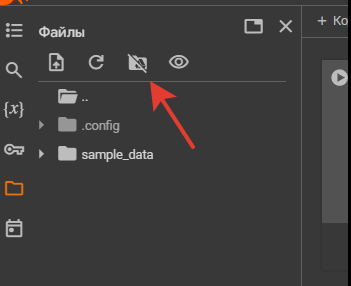
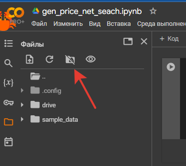
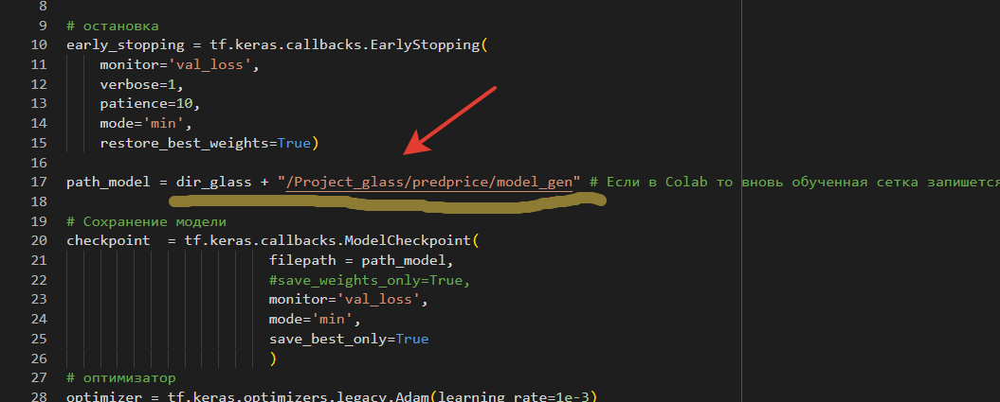
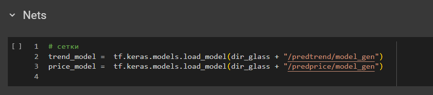

## Генетический поиск нейронок
- Проведены работы по созданию отдельно репозитория [генетического поиска](https://github.com/Mike030668/Genetic_generation_net)
- код модифицирован для применения как к ценовым, так и трендовым моделям

##### ноутбуки для поиска моделей
- [ценовая](https://github.com/Mike030668/Project_glass/blob/master/notebooks_gen/gen_price_net_seach.ipynb)
- [трендовая](https://github.com/Mike030668/Project_glass/blob/master/notebooks_gen/train_gen_trend_model.ipynb)

##### как пользоваться?
- настроено для работы в Colab и GPU
- изначально генетика стартует с данных на репозитории, которые были полученны поиском при работе над задачей
  
  
  
- можно стартавать с пустого состояния
  
  
  
- в обоих случаях пишется в копию репозиторя в Colab, скачаного ранее командой `!git clone https://github.com/Mike030668/Project_glass.git -q`
  После закрытия сессии, эти данный удвляться

- для реальной работы нужно подклбчить GD

   

- далее выбрать нужную папку куда будет писаться история и где в итоге будет обновляться основной файл - `bestnets.npy`
- Чтобы стартовать с данных, которые есть в гитхабе, нужно скопировать `Project_glass/gen_price_models
/bestnets.npy` в папку на диске для ценовой сетке и `Project_glass/gen_trend_models/bestnets.npy` для трендовой сетки в сответствубщие папки на своем диске.
И далее работать с этипи папками при работе в Colab после подключения жиска.

## После генетического поиска
- в [ноутбуке](https://github.com/Mike030668/Project_glass/blob/master/notebooks_gen/train_gen_price_model.ipynb) производится генерация из списка `bestnets.npy` для ценовой сетки. Далее обучение как и в  [ноутбуке](https://github.com/Mike030668/Project_glass/blob/master/notebooks/train_predprice_model.ipynb)
- в [ноутбуке](https://github.com/Mike030668/Project_glass/blob/master/notebooks_gen/train_gen_trend_model.ipynb) производится генерация из списка `bestnets.npy` для трендовой сетки. Далее обучение как и в  [ноутбуке](https://github.com/Mike030668/Project_glass/blob/master/notebooks/train_predtrend_model.ipynb)
- обученная сетка также изначально сохраняется во временную папку проекта в Colab
  
  

- поэтому, для дальнейшего тестирования нужно сохранять в свою папку на диске

## Тестирование роботов
- тестирование 3х роботов организовано в ноутбуках [Robot_1](https://github.com/Mike030668/Project_glass/blob/master/notebooks_gen/Robot_gen_1_testing.ipynb), [Robot_2](https://github.com/Mike030668/Project_glass/blob/master/notebooks_gen/Robot_gen_2_testing.ipynb), [Robot_3](https://github.com/Mike030668/Project_glass/blob/master/notebooks_gen/Robot_gen_3_testing.ipynb). Они аналогичны ноутбукам [Robot_1](https://github.com/Mike030668/Project_glass/blob/master/notebooks/Robot_1_testing.ipynb), [Robot_2](https://github.com/Mike030668/Project_glass/blob/master/notebooks/Robot_2_testing.ipynb), [Robot_3](https://github.com/Mike030668/Project_glass/blob/master/notebooks/Robot_3_testing.ipynb)
  
- изначально грузятся списки нвйденых сеток в процессе поиска при решения задачи по созданию репозитория. В каждой по 3 сетки
  
 
 
- для работы со своей папкой от поиска генетики нужно указать путь до них после подклбчения диска
